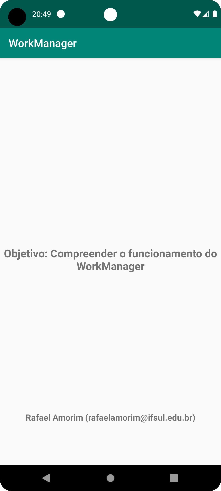

    

# Exemplo de uso do AsyncTask

Repositório criado para mostrar uma aplicação simples usando WorkManager na disciplina de
Desenvolvimento Mobile II, do curso de Tecnólogo em Analise e Desenvolvimento de Sistemas do
Instituto Federal Sul Riograndense (IFSul), [Campus Santana do Livramento](http://www.santana.ifsul.edu.br/).

## Screenshot

    

## Sobre a WorkManager

O WorkManager é uma biblioteca do Android Jetpack que oferece uma solução robusta para trabalhos em segundo plano. Aqui estão algumas de suas principais características:

- **Compatibilidade com versões anteriores**: Funciona em dispositivos com API nível 14 ou superior.
- **Execução garantida**: As tarefas são executadas mesmo se o aplicativo for fechado ou o dispositivo for reiniciado.
- **Flexibilidade**: Suporta tarefas únicas e periódicas.
- **Restrições de tarefa**: Permite definir condições como conectividade de rede, status de carregamento da bateria e requisitos de armazenamento.
- **Encadeamento de tarefas**: Possibilidade de encadear várias tarefas, inclusive em paralelo.
- **Integração com LiveData**: Facilita a observação do estado das tarefas e a atualização da interface do usuário.
- **Escolha inteligente de API**: Seleciona automaticamente a melhor API de agendamento de tarefas (como `JobScheduler`, `Firebase Job Dispatcher` ou `AlarmManager`) com base no nível da API do dispositivo¹².

Essas características tornam o WorkManager uma ferramenta poderosa e flexível para gerenciar tarefas em segundo plano no Android, adequada para uma variedade de casos de uso, como upload de arquivos, sincronização de dados e processamento de imagens¹².

Origem: conversa com o Bing, 26/03/2024
(1) Trabalho em segundo plano com WorkManager (Kotlin). https://developer.android.com/codelabs/android-workmanager?hl=pt-BR.
(2) WorkManager — O que é? Como usar? | by Haldny Santos - Medium. https://medium.com/android-dev-br/workmanager-o-que-%C3%A9-como-usar-26f5b800984e.
(3) Trabalho em segundo plano com a WorkManager (Java). https://developer.android.com/codelabs/android-workmanager-java?hl=pt-br.